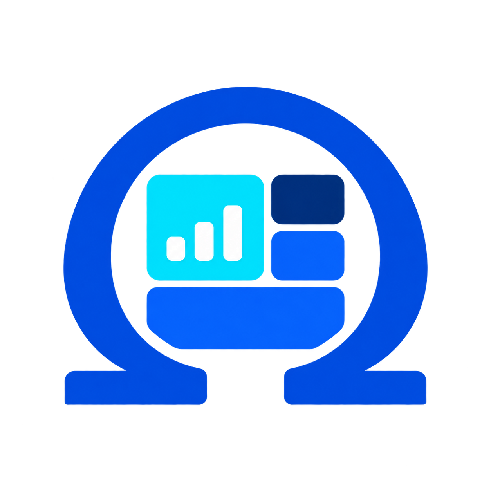

<p align="center">
  
</p>

<h1 align="center">Omega Panel</h1>

<p align="center">
  <strong>Give your coding agent a production dashboard playbook.</strong>
</p>

<p align="center">
  Plan, build, and review polished admin panels in the stack you already use.
</p>

<p align="center">
  
  
  
  
  <a href="LICENSE"></a>
</p>

---

## 👋 Meet Omega Panel

Omega Panel is a portable Agent Skill for building dashboards and admin interfaces that are useful beyond the first screenshot. It gives compatible coding agents a shared workflow for information architecture, navigation, tables, filters, forms, charts, responsive behavior, accessibility, and worldwide readiness.

It works with **Codex, Claude Code, Cursor, and other Agent Skills-compatible tools**. The skill is framework-neutral: it fits the repository you already have instead of forcing every project into React or another single stack.

> ✨ **No runtime dependency or API key is required.** Omega Panel guides your agent; it does not become part of your production bundle.

## ⚡ Quick start

### 1. Install the skill

```bash
npx skills add omega-do-it-solutions/OmegaPanel --skill omega-panel
```

The installer detects supported agents and lets you choose where to install the skill. A project installation is usually best for teams because it can be committed with the application.

> 🔐 The repository is currently private. Installation requires repository access and authenticated Git credentials, or an available `GITHUB_TOKEN`.

### 2. Ask your agent to use it

```text
$omega-panel Build an order-management dashboard in this repository.
Use the existing stack and design system. Include responsive table behavior,
filters, URL-backed state, loading and error states, accessibility, and RTL.
```

Use `/omega-panel` in Claude Code or Cursor. Compatible agents can also select the skill automatically when your request matches its purpose.

### 3. Review the result

```text
$omega-panel Review this dashboard and rank issues by severity. Check the
navigation shell, tables, forms, charts, responsive behavior, accessibility,
internationalization, loading states, permissions, and failure states.
```

That is enough to get started. Everything below helps you use Omega Panel more deliberately.

## ✨ What Omega Panel brings to a project

| Area | What the skill helps your agent produce |
| --- | --- |
| 🧭 Structure | Breadcrumb-led admin pages, purposeful stat cards, clear primary content, and decision-first hierarchy |
| 🗂 Navigation | Expanded, collapsed, hover/focus-preview, mobile drawer, and recursive nested navigation behavior |
| 🔎 Data tables | Toolbars, search, filter drawers, clearable three-state sorting, pagination, resizing, pinning, and URL state |
| 📝 Forms and editors | Accessible controls, coherent save/publish commands, unsaved-work safety, state-valid account actions, and submit-first validation |
| 📈 Charts | Honest chart selection, ApexCharts guidance, smooth curves, restrained animation, and accessible alternatives |
| 🌍 Global UX | Locale-aware copy, dates, time zones, numbers, currencies, fonts, RTL, search, sort, and export |
| ♿ Accessibility | Semantic structure, keyboard behavior, focus management, contrast, reflow, announcements, and reduced motion |
| 📱 Responsive UX | Explicit desktop, intermediate, mobile, zoom, text-expansion, and touch behavior |

## 🧪 Try these prompts

### Plan a new dashboard

```text
$omega-panel Plan a worldwide revenue dashboard for finance leaders.
Cover desktop and mobile, roles, permissions, loading and failure states,
accessibility, RTL, currencies, reporting time zones, and acceptance criteria.
```

### Implement inside an existing project

```text
$omega-panel Implement a customer operations dashboard in this repository.
Preserve the current framework, routing, package manager, and design system.
Add only the packages the feature actually needs.
```

### Refine an existing plan

```text
$omega-panel Refine this dashboard plan for a multilingual support team.
Preserve accepted decisions and call out every changed assumption.
```

### Pair it with the code-quality companion

```text
$code-quality Add this page using the repository's current structure. Keep the
page readable as composition, extract meaningful behavior, and do not refactor
unrelated code.
```

Install the companion independently when you want implementation-boundary guidance without the full dashboard workflow:

```bash
npx skills add omega-do-it-solutions/OmegaPanel --skill code-quality
```

---

## 🤖 Agent support

| Agent | Project location | Personal/global location | Explicit invocation |
| --- | --- | --- | --- |
| Codex | `.agents/skills/omega-panel/` | `~/.agents/skills/omega-panel/` | `$omega-panel` |
| Claude Code | `.claude/skills/omega-panel/` | `~/.claude/skills/omega-panel/` | `/omega-panel` |
| Cursor | `.agents/skills/omega-panel/` or `.cursor/skills/omega-panel/` | `~/.cursor/skills/omega-panel/` | `/omega-panel` or `@omega-panel` |
| Other Agent Skills clients | Usually `.agents/skills/omega-panel/` | Agent-specific | Agent-specific |

The canonical skill uses portable `name` and `description` frontmatter. The optional `agents/openai.yaml` adds OpenAI-facing presentation metadata and is safely ignored by other clients.

- [OpenAI documentation: build and install skills](https://developers.openai.com/es-419/docs/build-skills)
- [Claude documentation: Agent Skills](https://platform.claude.com/docs/en/agents-and-tools/agent-skills/overview)
- [Cursor documentation: Agent Skills](https://cursor.com/docs/skills)

## 📦 Installation options

### Install globally

Use Omega Panel across all of your projects:

```bash
npx skills add omega-do-it-solutions/OmegaPanel \
  --skill omega-panel \
  --global
```

### Install for several agents without prompts

```bash
npx skills add omega-do-it-solutions/OmegaPanel \
  --skill omega-panel \
  --global \
  --agent codex \
  --agent claude-code \
  --agent cursor \
  --yes
```

### Preview without installing

```bash
npx skills use omega-do-it-solutions/OmegaPanel \
  --skill omega-panel \
  --agent claude-code
```

### Install manually

If `npx` is unavailable, clone the repository and copy the complete skill directory:

```bash
git clone git@github.com:omega-do-it-solutions/OmegaPanel.git
cd OmegaPanel

# Codex, Cursor, and universal Agent Skills clients
mkdir -p /path/to/project/.agents/skills
cp -R skills/omega-panel /path/to/project/.agents/skills/omega-panel

# Claude Code
mkdir -p /path/to/project/.claude/skills
cp -R skills/omega-panel /path/to/project/.claude/skills/omega-panel
```

Copy the entire directory—not only `SKILL.md`. The references, templates, prompts, checklists, and brand asset are part of the package.

## 🧠 How the skill works

Omega Panel chooses one of four modes from the user's request:

1. **Plan** — turn requirements and data into an implementation-ready dashboard specification.
2. **Implement** — build the approved experience in the repository's existing stack.
3. **Review** — inspect a design or implementation and return evidence-backed findings by severity.
4. **Refine** — update an existing plan while preserving accepted decisions and exposing changed assumptions.

The workflow connects product decisions to data contracts, information architecture, component behavior, editor/settings mutation lifecycles, responsive layout, implementation boundaries, accessibility, internationalization, QA, and acceptance criteria. Package suggestions are treated as a capability menu—not an install-everything list.

## 🧰 Recommended implementation capabilities

Omega Panel can guide an agent toward the following tools when they match the selected ecosystem and the project does not already have an approved equivalent:

- **Tables and server state:** TanStack Table and TanStack Query
- **HTTP:** Axios
- **Charts:** ApexCharts
- **Dates:** Day.js
- **Validation:** Zod with React Hook Form, VeeValidate, or an ecosystem-native equivalent
- **Internationalization:** i18next or the project's established solution
- **Editors and rich content:** TipTap and Shiki
- **Maps:** jsVectorMap and Leaflet
- **Motion and UI utilities:** Motion, SimpleBar, Sonner, and Swiper
- **Quality:** ESLint and Prettier

The React profile adds concrete guidance for complete-dataset client sorting, server-owned filters, URL query parameters, query cancellation, logical column pinning, ApexCharts, localized Day.js formatting, Inter for Latin scripts, and Vazirmatn for Persian. Other ecosystems should use equivalent native patterns.

## 🗂 Repository map

```text
skills/omega-panel/
  SKILL.md                 Portable workflow and input/output contract
  agents/openai.yaml       Optional OpenAI UI metadata
  assets/                  Installable Omega Panel brand assets
  references/              Detailed guidance loaded when relevant
  templates/               Intake, plan, and review structures
  checklists/              Dashboard and worldwide-readiness release gates
  prompts/                 Reusable planning and review prompts
skills/code-quality/
  SKILL.md                 Project-fit implementation and decomposition rules
  agents/openai.yaml       Optional OpenAI UI metadata
  references/              React/TypeScript fallback ownership structure
examples/                  Worked analytics, operations, and SaaS examples
evals/                     Scenarios, scoring rubric, and baseline
scripts/                   Dependency-free repository validation
```

Only the selected skill directory is installed. Examples and evaluations are maintainer resources.

## ✅ Validate the repository

```bash
node scripts/validate-repository.mjs
```

The validator checks the skill entrypoint, portable frontmatter, required package files, logo, and relative Markdown links. CI runs the same command on pushes and pull requests.

When developing inside Codex's skill environment, also run:

```bash
python3 /path/to/skill-creator/scripts/quick_validate.py skills/omega-panel
```

## 🤝 Contributing

Read [CONTRIBUTING.md](CONTRIBUTING.md) for the contribution workflow and evaluation requirements. User-visible changes belong in [CHANGELOG.md](CHANGELOG.md).

Omega Panel is available under the [MIT License](LICENSE).
