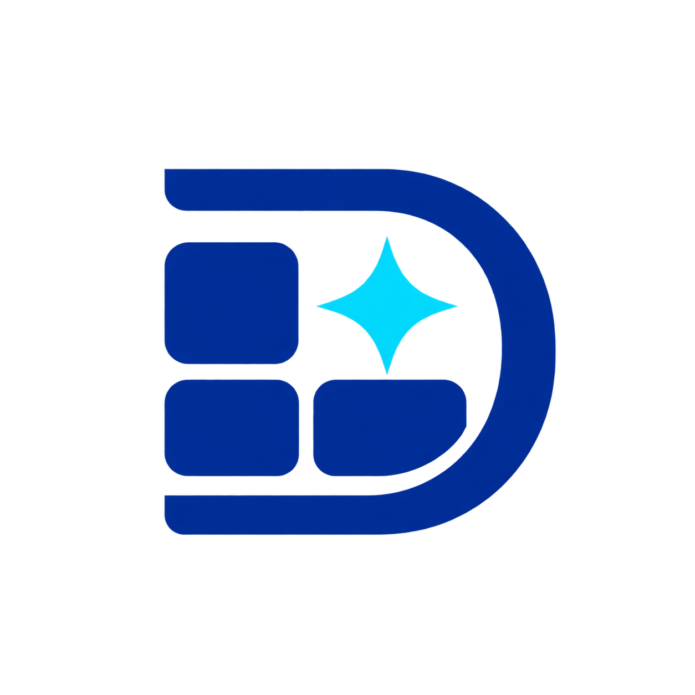

<p align="center">
  
</p>

<h1 align="center">DashCraft</h1>

<p align="center">
  A portable Agent Skill for designing, implementing, and reviewing production dashboards and admin interfaces.
</p>

<p align="center">
  <a href="LICENSE"></a>
</p>

DashCraft packages dashboard information architecture, application shells, tables, filters, forms, charts, responsive behavior, accessibility, and worldwide readiness into one reusable workflow. It follows the portable `SKILL.md` Agent Skills format and keeps one source of truth for Codex, Claude Code, Cursor, and other compatible coding agents.

## Install

Install from GitHub with the cross-agent [`skills` CLI](https://github.com/vercel-labs/skills):

```bash
npx skills add omega-do-it-solutions/DashCraft --skill dashboard-craft
```

The installer detects supported agents and lets you choose the destination. The default project installation is best for teams because the installed skill can be committed with the application.

If this GitHub repository is private, the user must have repository access and authenticated Git credentials (or a `GITHUB_TOKEN` available in their environment). If the repository is made public, the same command works without authentication and can also be listed on [skills.sh](https://skills.sh/).

Install globally for use across projects:

```bash
npx skills add omega-do-it-solutions/DashCraft \
  --skill dashboard-craft \
  --global
```

Install non-interactively for Codex, Claude Code, and Cursor:

```bash
npx skills add omega-do-it-solutions/DashCraft \
  --skill dashboard-craft \
  --global \
  --agent codex \
  --agent claude-code \
  --agent cursor \
  --yes
```

Preview or run the skill without installing it:

```bash
npx skills use omega-do-it-solutions/DashCraft \
  --skill dashboard-craft \
  --agent claude-code
```

The skill itself has no runtime dependency, API key, or framework requirement. Its package recommendations apply only when an agent is implementing a dashboard that needs those capabilities.

## Agent support

| Agent | Project location | Personal/global location | Explicit invocation |
| --- | --- | --- | --- |
| Codex | `.agents/skills/dashboard-craft/` | `~/.agents/skills/dashboard-craft/` | `$dashboard-craft` |
| Claude Code | `.claude/skills/dashboard-craft/` | `~/.claude/skills/dashboard-craft/` | `/dashboard-craft` |
| Cursor | `.agents/skills/dashboard-craft/` or `.cursor/skills/dashboard-craft/` | `~/.cursor/skills/dashboard-craft/` | `/dashboard-craft` or `@dashboard-craft` |
| Other Agent Skills clients | Usually `.agents/skills/dashboard-craft/` | Agent-specific | Agent-specific |

The canonical skill uses only the required portable frontmatter fields, `name` and `description`. The optional `agents/openai.yaml` supplies Codex/ChatGPT presentation metadata and is safely ignored by other clients.

- [OpenAI documentation: build and install skills](https://developers.openai.com/es-419/docs/build-skills)
- [Claude documentation: Agent Skills](https://platform.claude.com/docs/en/agents-and-tools/agent-skills/overview)
- [Cursor documentation: Agent Skills](https://cursor.com/docs/skills)

### Manual installation

If `npx` is unavailable, clone this repository and copy the complete skill directory to the agent's native project location:

```bash
git clone git@github.com:omega-do-it-solutions/DashCraft.git
cd DashCraft

# Codex, Cursor, and universal Agent Skills clients
mkdir -p /path/to/project/.agents/skills
cp -R skills/dashboard-craft /path/to/project/.agents/skills/dashboard-craft

# Claude Code
mkdir -p /path/to/project/.claude/skills
cp -R skills/dashboard-craft /path/to/project/.claude/skills/dashboard-craft
```

Copy the entire directory, not only `SKILL.md`; its references, templates, prompts, checklists, and logo are part of the package.

## Use

### Plan a dashboard

```text
$dashboard-craft Plan a worldwide revenue dashboard for finance leaders.
Cover desktop and mobile, permissions, loading and failure states,
accessibility, RTL, currencies, and reporting time zones.
```

### Implement in the current stack

```text
$dashboard-craft Implement an order-management dashboard in this repository.
Preserve the existing framework and design system. Add only the packages the
feature needs.
```

### Review an implementation

```text
$dashboard-craft Review this dashboard for information hierarchy, sidebar
behavior, tables, URL state, form validation, charts, accessibility, responsive
behavior, and internationalization. Rank findings by severity.
```

In Claude Code or Cursor, replace `$dashboard-craft` with `/dashboard-craft`. Compatible agents may also select the skill automatically when a request matches its description.

## What the skill covers

- decision-oriented information architecture and metric contracts;
- breadcrumb-led admin pages with optional stat cards and primary content;
- expanded, collapsed, and hover/focus-preview sidebar states;
- table toolbars, filter drawers, clearable sorting, pagination, resizing, pinning, and URL state;
- server-backed request ownership, loading, stale, empty, error, permission, and conflict states;
- submit-first form validation followed by input revalidation;
- honest charts, accessible alternatives, and restrained motion;
- locale-aware messages, dates, time zones, numbers, currencies, units, fonts, RTL, search, sort, and export;
- desktop, intermediate, mobile, zoom/reflow, keyboard, screen-reader, and reduced-motion behavior.

The workflow is framework-neutral. ApexCharts, TanStack tools, TipTap, Axios, Day.js, i18next, jsVectorMap, Leaflet, Motion, Shiki, SimpleBar, Sonner, Swiper, Zod, React Hook Form, VeeValidate, ESLint, and Prettier are a capability menu—not an install-all dependency list.

## Repository map

```text
skills/dashboard-craft/
  SKILL.md                 Portable workflow and input/output contract
  agents/openai.yaml       Optional OpenAI UI metadata
  assets/                  Installable brand assets
  references/              Detailed guidance loaded when relevant
  templates/               Intake, plan, and review structures
  checklists/              Dashboard and worldwide-readiness release gates
  prompts/                 Reusable planning and review prompts
examples/                  Worked analytics, operations, and SaaS examples
evals/                     Scenarios, scoring rubric, and baseline
scripts/                   Repository validation
```

Only `skills/dashboard-craft/` is installed. The examples and evaluation suite are maintainer resources.

## Validate

Run the dependency-free repository checks:

```bash
node scripts/validate-repository.mjs
```

The validator checks the skill entrypoint, portable frontmatter, required package files, logo, and relative Markdown links. CI runs the same command on pushes and pull requests.

## Contributing

See [CONTRIBUTING.md](CONTRIBUTING.md) for workflow and evaluation requirements and [CHANGELOG.md](CHANGELOG.md) for release notes. DashCraft is available under the [MIT License](LICENSE).
